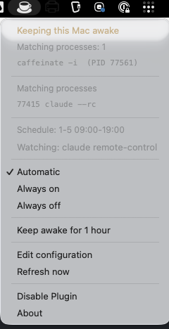
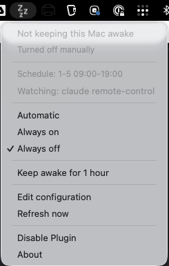

# caffeinate-scheduler

A [SwiftBar](https://github.com/swiftbar/SwiftBar) plugin that keeps macOS awake **only while a watched process is running**, and **only inside the days and hours you configure**.

Originally built for [Claude Code](https://code.claude.com) Remote Control sessions: the Mac should stay awake while a session is reachable from a phone, but go back to sleeping normally outside working hours.

| ☕️ Keeping the Mac awake | 💤 Not keeping the Mac awake |
| --- | --- |
|  |  |

- Menu bar icon shows whether sleep is currently being prevented, and why
- Auto / always-on / always-off, switchable from the menu
- One-off "keep awake for the next hour" override
- Optional battery guard: require AC power, or back off below a charge floor
- Detects `caffeinate` processes started elsewhere (terminal, other apps) and can stop them
- Menu in English or Japanese, following your system locale by default
- Wraps Apple's own `caffeinate(1)`. No kexts, no extra permissions, no daemons

## Requirements

- macOS 10.15+ with [SwiftBar](https://github.com/swiftbar/SwiftBar) (`brew install swiftbar`)
- Bash — the stock `/bin/bash` (3.2) is enough
- Also runs under [xbar](https://github.com/matryer/xbar), with emoji instead of SF Symbols

## Install

```bash
curl -o "$(defaults read com.ameba.SwiftBar PluginDirectory)/caffeinate-scheduler.30s.sh" \
  https://raw.githubusercontent.com/take-m/swiftbar-caffeinate-scheduler/main/caffeinate-scheduler.30s.sh
chmod +x "$(defaults read com.ameba.SwiftBar PluginDirectory)/caffeinate-scheduler.30s.sh"
```

Or drop the file into your SwiftBar plugin folder by hand. SwiftBar picks it up immediately.

The `30s` in the filename is the refresh interval, which is also how often the rules are re-evaluated. Rename it (`caffeinate-scheduler.1m.sh`) to poll less often — but note that this is also the worst-case delay before sleep prevention kicks in after you start a session.

## Configuration

On first run the plugin writes `~/.config/caffeinate-scheduler/config.sh`. Edit it from the menu (**Edit configuration**) or directly:

```bash
# Menu language: auto | en | ja. "auto" follows the macOS system locale.
UI_LANGUAGE="auto"

# Processes to watch. Substring matches against the `ps` argument line, separated by |.
WATCH_PATTERNS="claude remote-control|claude --remote-control|claude --rc"

# When the rules are allowed to apply. Multiple windows separated by ;
# Weekday numbers follow `date +%u`: 1=Mon … 7=Sun. Ranges (1-5) and lists (1,3,5) both work.
# If start > end the window wraps past midnight, e.g. "1-5 22:00-02:00".
# Empty string means no time restriction.
SCHEDULE="1-5 09:00-22:00"

# Keep preventing sleep for this many minutes after the watched process disappears.
GRACE_MINUTES=5

# Only prevent sleep while the Mac is on AC power.
REQUIRE_AC=false

# While on battery, stop preventing sleep once the charge drops below this
# percentage. 0 disables the check.
BATTERY_FLOOR=0

# Flags passed to caffeinate.
#   -i   prevent idle system sleep (display still turns off) — usually what you want
#   -di  also keep the display on
CAFFEINATE_FLAGS="-i"
```

### Matching Claude Code sessions

Remote Control is hosted by the CLI or the VS Code extension, so the local `claude` process is a reliable signal — if it stops, the session ends anyway.

The default patterns match explicit invocations (`claude remote-control`, `claude --rc`, `/remote-control`). **If you have auto-connect turned on** — `/config` → *Enable Remote Control for all sessions*, or `remoteControlAtStartup: true` in `~/.claude/settings.json` — then plain `claude` sessions are remote-controllable too, and you should loosen the pattern:

```bash
WATCH_PATTERNS="claude"
```

The trade-off is false positives: anything with `claude` in its command line (`grep claude`, an editor with the string in a filename) will match. Narrow it back down if that becomes annoying.

### Battery guard

`REQUIRE_AC` and `BATTERY_FLOOR` read `pmset -g batt` and outrank every other rule, including **Always on** and the temporary overrides — protecting the battery is the point, so nothing overrides them.

- `REQUIRE_AC=true` releases sleep prevention whenever the Mac runs on battery power
- `BATTERY_FLOOR=20` releases it once the battery drops below 20% — but only while discharging; on AC power the battery is charging, so the floor does not apply
- On a Mac without a battery, or if the power state cannot be read, both checks stay quiet

### Menu language

`UI_LANGUAGE` accepts `auto`, `en`, or `ja`. On `auto` the plugin reads `defaults read -g AppleLocale`, falls back to `$LANG`, and settles on English if neither says Japanese. Anything unrecognised in the config falls back to `auto` rather than erroring.

Adding a language means adding one `msg_<code>()` function to the plugin — nothing else. `t()` falls back to English for any key a catalogue is missing, so a partial translation still renders. `tests/test_i18n.py` checks that every catalogue has the same keys and the same `printf` format specifiers, and that no key is defined but unused.

## How it works

SwiftBar standard plugins are stateless — they run, print, and exit. So instead of holding state in a daemon, every refresh performs a full reconcile:

1. Read config and the current mode
2. Decide whether sleep should be prevented right now (power gates → override → mode → schedule → process match → grace period)
3. Compare against reality and start or stop `caffeinate` accordingly
4. Print the menu

A side effect is self-healing: if the `caffeinate` child is killed by anything, the next refresh notices and restarts it.

State lives in `$SWIFTBAR_PLUGIN_DATA_PATH` (mode, override deadline, PID of the managed `caffeinate`, last time the watched process was seen). The plugin only ever kills the `caffeinate` it started itself, unless you explicitly choose **Stop all of them**.

## Limitations

- **Closed lid.** `caffeinate` prevents *idle* sleep. A MacBook with the lid shut still sleeps. Defeating that needs `sudo pmset -a disablesleep 1`, which requires root, so it is deliberately out of scope here.
- **Substring matching.** `WATCH_PATTERNS` is matched against the full `ps` argument line with `grep -F`. It is simple and dependency-free, not precise.
- **Up to one refresh interval of lag.** Starting a session does not instantly prevent sleep; the next refresh does. Use the **Keep awake for 1 hour** override if you need it immediately.

## Development

```bash
./tests/test_schedule.sh                       # schedule parsing and window matching
./tests/test_i18n.py caffeinate-scheduler.30s.sh   # translation catalogue parity
./tests/test_version.sh                        # version numbers agree
./tests/lint_bash32.py *.sh tests/*.sh         # bash 3.2 compatibility
shellcheck -x *.sh tests/*.sh
shfmt -d -i 4 -ci *.sh tests/*.sh
```

The plugin can be sourced with `CAFFEINATE_SCHEDULER_LIB_ONLY=1` to load only the pure functions, which is how the tests inject a fake clock.

### Target bash 3.2, not your bash

macOS still ships bash **3.2.57** (2007) as `/bin/bash`, and SwiftBar runs plugins through it. Anything written against bash 4 or 5 will pass locally on a Homebrew bash and then break for every user. Two footguns that have already bitten this repo:

- **`case` inside `$( )`.** The 3.2 parser mistakes the `)` that closes a case pattern for the end of the command substitution, and you get `syntax error near unexpected token 'newline'`. Restructure to avoid the substitution, or write the pattern as `(*-*)` so the parens balance.
- **Nested quoted parameter expansion** such as `${v#"${v%%[![:space:]]*}"}`. Use word splitting instead.

`tests/lint_bash32.py` checks for these and for bash 4-only features. The `macos-latest` CI job is the real backstop — its `/bin/bash` is 3.2.

## License

MIT — see [LICENSE](LICENSE).
